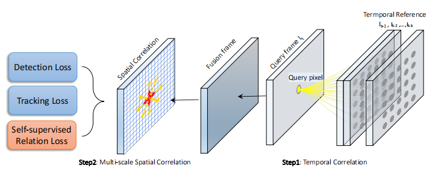
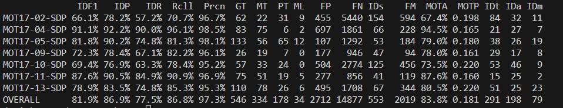
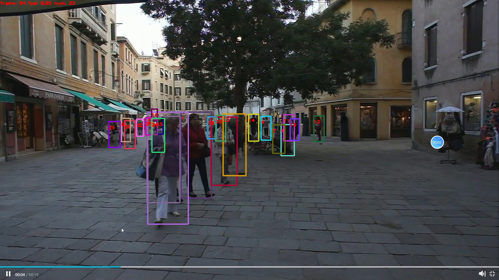
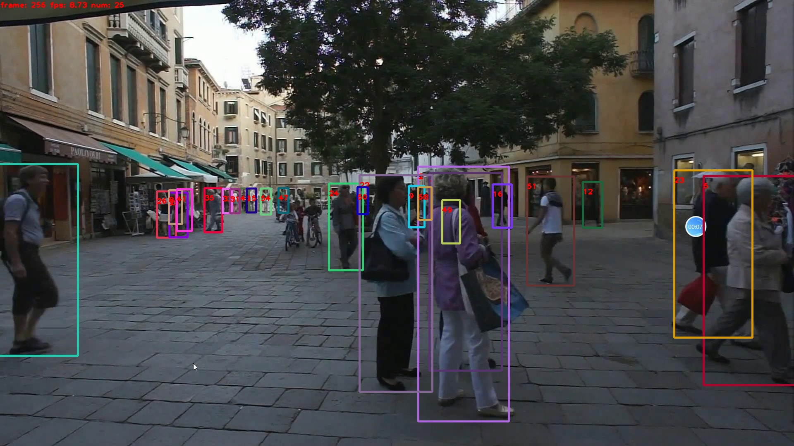
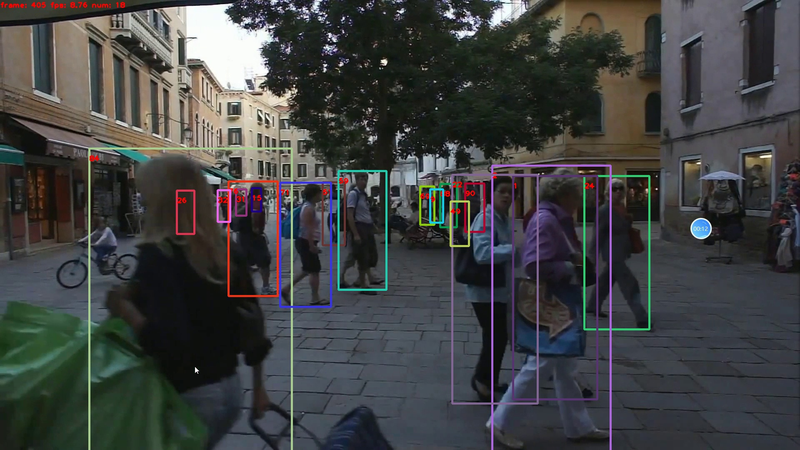

# CorrMOT: Multi-object Tracking with Correlation Learning
An enhancement method for multi-object tracking with correlation learning.

> [**Multiple Object Tracking with Correlation Learning**](https://arxiv.org/abs/2104.03541),            
> Qiang Wang, Yun Zheng, Pan Pan, Yinghui Xu,        
## Abstract
Recent works have shown that convolutional networks have substantially improved the performance of multiple object tracking by simultaneously learning detection and appearance features. However, due to the local perception of the convolutional network structure itself, the long-range dependencies in both the spatial and temporal cannot be obtained efficiently. To incorporate the spatial layout, we propose to exploit the local correlation module to model
the topological relationship between targets and their surrounding environment, which can enhance the discriminative power of our model in crowded scenes. Specifically, we establish dense correspondences of each spatial location and its context, and explicitly constrain the correlation volumes through self-supervised learning. To exploit the temporal context, existing approaches generally utilize two or more adjacent frames to construct an enhanced feature representation, but the dynamic motion scene is inherently difficult to depict via CNNs. Instead, our paper proposes a learnable correlation operator to establish frameto-frame matches over convolutional feature maps in the different layers to align and propagate temporal context.
With extensive experimental results on the MOT datasets, our approach demonstrates the effectiveness of correlation learning with the superior performance and obtains stateof-the-art MOTA of 83.8% and IDF1 of 81.9% on MOT17.

## Tracking performance
### Results on MOT challenge test set
| Dataset    | MOTA | IDF1 | IDP  |  IDR  |  Rcll | Prcn  |
|------------|------|------|------|-------|-------|-------|
|MOT17       | 83.8 | 86.9 | 86.9 | 77.5% | 86.8% | 97.3% |



## Installation
* Clone this repo, and we'll call the directory that you cloned as ${CORRMOT_ROOT}
* Install dependencies. We use python 3.8 and pytorch 1.x, cuda 11.x
```
conda create -n CorrMOT python=3.8
conda activate CorrMOT
pip install pytorch==1.10.1 torchvision==0.11.2 torchaudio==0.10.1
(**we strongly suggest to use pip instead of conda to avoid dependency issues**)
cd ${CorrMOT_ROOT}
pip install cython
pip install -r requirements.txt
sudo apt-get install ninja-build
```
**¡Attention!**
* Since this project is tested on Windows11, we choose the windows version of DCNv2 [DCN v2 - PyTorch v1.10.x and Older](https://github.com/rathaROG/DCNv2_Windows/tree/torch-legacy)

* In order to run the code for demos, you also need to install [ffmpeg](https://www.ffmpeg.org/).

## Data preparation

* **CrowdHuman**
The CrowdHuman dataset can be downloaded from their [official webpage](https://www.crowdhuman.org). After downloading, you should prepare the data in the following structure:
```
crowdhuman
   |——————images
   |        └——————train
   |        └——————val
   └——————labels_with_ids
   |         └——————train(empty)
   |         └——————val(empty)
   └------annotation_train.odgt
   └------annotation_val.odgt
```
If you want to pretrain on CrowdHuman (we train Re-ID on CrowdHuman), you can change the paths in src/gen_labels_crowd_id.py and run:
```
cd src
python gen_labels_crowd_id.py
```
If you want to add CrowdHuman to the MIX dataset (we do not train Re-ID on CrowdHuman), you can change the paths in src/gen_labels_crowd_det.py and run:
```
cd src
python gen_labels_crowd_det.py
```
* **MIX**
We use the same training data as [JDE](https://github.com/Zhongdao/Towards-Realtime-MOT) in this part and we call it "MIX". Please refer to their [DATA ZOO](https://github.com/Zhongdao/Towards-Realtime-MOT/blob/master/DATASET_ZOO.md) to download and prepare all the training data including Caltech Pedestrian, CityPersons, CUHK-SYSU, PRW, ETHZ, MOT17 and MOT16. 
* **2DMOT15 and MOT20** 
[2DMOT15](https://opendatalab.com/73) and [MOT17](https://opendatalab.com/70), you should prepare the data in the following structure:
```
MOT15
   |——————images
   |        └——————train
   |        └——————test
   └——————labels_with_ids
            └——————train(empty)
```
Then, you can change the seq_root and label_root in src/gen_labels_15.py and run:
```
cd src
python gen_labels_15.py
```
to generate the labels of 2DMOT15. The seqinfo.ini files of 2DMOT15 can be downloaded here [[Google]](https://drive.google.com/open?id=1kJYySZy7wyETH4fKMzgJrYUrTfxKlN1w), [[Baidu],code:8o0w](https://pan.baidu.com/s/1zb5tBW7-YTzWOXpd9IzS0g).

## Pretrained models and baseline model
* **Pretrained models**

DLA-34 COCO pretrained model: [DLA-34 official](https://drive.google.com/file/d/1pl_-ael8wERdUREEnaIfqOV_VF2bEVRT/view).
HRNetV2 ImageNet pretrained model: [HRNetV2-W18 official](https://1drv.ms/u/s!Aus8VCZ_C_33cMkPimlmClRvmpw), [HRNetV2-W32 official](https://1drv.ms/u/s!Aus8VCZ_C_33dYBMemi9xOUFR0w).
After downloading, you should put the pretrained models in the following structure:
```
${CORRMOT_ROOT}
   └——————models
           └——————ctdet_coco_dla_2x.pth
           └——————hrnetv2_w32_imagenet_pretrained.pth
           └——————hrnetv2_w18_imagenet_pretrained.pth
```
* **Baseline model**

Our baseline CorrMOT model (DLA-34 backbone) is pretrained on the CrowdHuman for 60 epochs with the self-supervised learning approach and then trained on the MIX dataset for 30 epochs. The models can be downloaded here: 
crowdhuman_dla34.pth [[Google]](https://drive.google.com/file/d/1SFOhg_vos_xSYHLMTDGFVZBYjo8cr2fG/view?usp=sharing) [[Baidu, code:ggzx ]](https://pan.baidu.com/s/1JZMCVDyQnQCa5veO73YaMw) [[Onedrive]](https://microsoftapc-my.sharepoint.com/:u:/g/personal/v-yifzha_microsoft_com/EUsj0hkTNuhKkj9bo9kE7ZsBpmHvqDz6DylPQPhm94Y08w?e=3OF4XN).
corrmot.pth [[Baidu, code:zafb]](https://pan.baidu.com/s/1BO16oyuI5uD4adn6zJbLGA) . (This is the model we get 83.8 MOTA on the MOT17 test set. )
After downloading, you should put the baseline model in the following structure:
```
${CORRMOT_ROOT}
   └——————models
           └——————corrmot.pth
           └——————...
```

## Training
* Download the training data
* Change the dataset root directory 'root' in src/lib/cfg/data.json and 'data_dir' in src/lib/opts.py
* Train on MOT17:
```
cd src
python train.py mot --exp_id mot17_dla34 --load_model '../models/ctdet_coco_dla_2x.pth' --data_cfg '../src/lib/cfg/mot17.json'
```
* Finetune on 2DMOT15 using the baseline model:
```
cd src
python train.py mot --exp_id mot15_ft_mix_dla34 --load_model '../models/corrmot_dla34.pth' --num_epochs 20 --lr_step '15' --data_cfg '../src/lib/cfg/mot15.json'
```

## Tracking 
* To get the txt results of the test set of  MOT17, you can run:
```
cd src
python track.py mot --test_mot17 True --load_model ../models/fairmot_dla34.pth --conf_thres 0.4
to see the tracking results (83.8 MOTA and 81.9 IDF1 using the baseline model). You can also set save_images=True in src/track.py to save the visualization results of each frame.
```
* To get the SOTA results of 2DMOT15, run the tracking code:
```
cd src
python track.py mot --test_mot15 True --load_model your_mot15_model.pth --conf_thres 0.3
```
Results of the test set all need to be evaluated on the MOT challenge server. You can see the tracking results on the training set by setting --val_motxx True and run the tracking code. We set 'conf_thres' 0.4 for MOT17. We set 'conf_thres' 0.3 for 2DMOT15. 

## Demo
You can input a raw video and get the demo video by running src/demo.py and get the mp4 format of the demo video:
```
cd src
python demo.py mot --load_model ../models/corrmot.pth --conf_thres 0.4
```
You can change --input-video and --output-root to get the demos of your own videos.
--conf_thres can be set from 0.3 to 0.7 depending on your own videos.




## Train on custom dataset
You can train FairMOT on custom dataset by following several steps bellow:
1. Generate one txt label file for one image. Each line of the txt label file represents one object. The format of the line is: "class id x_center/img_width y_center/img_height w/img_width h/img_height". You can modify src/gen_labels_16.py to generate label files for your custom dataset.
2. Generate files containing image paths. The example files are in src/data/. Some similar code can be found in src/gen_labels_crowd.py
3. Create a json file for your custom dataset in src/lib/cfg/. You need to specify the "root" and "train" keys in the json file. You can find some examples in src/lib/cfg/.
4. Add --data_cfg '../src/lib/cfg/your_dataset.json' when training. 

